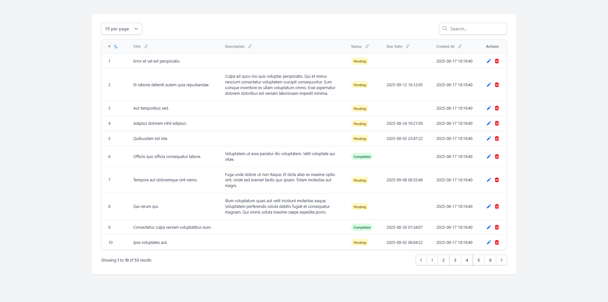

# Laravel Livewire DataTable

[](https://packagist.org/packages/developerawam/livewire-datatable)
[](https://packagist.org/packages/developerawam/livewire-datatable)
[](https://saweria.co/developerawam)

A powerful, flexible, and customizable DataTable component for Laravel Livewire applications with built-in features like sorting, searching, and pagination.

## Requirements

- PHP ^8.2
- Laravel ^12.0
- Livewire ^3.0
- Tailwind CSS ^3.0

### Browser Support

- Chrome (latest)
- Firefox (latest)
- Safari (latest)
- Edge (latest)



### Light and Dark Mode Support

The datatable automatically adapts to your application's theme:

## Laravel Livewire DataTable

A powerful, flexible, and customizable DataTable component for Laravel Livewire applications with built-in features like sorting, searching, and pagination.

## Features

- 🔍 Live Search
- 🔄 Column Sorting
- 📄 Pagination
- 🎨 Fully Customizable Theming
- 🌓 Dark Mode Support
- 📱 Responsive Design
- 🔗 Relationship Support
- ⚡ Real-time Updates

## Installation

You can install the package via composer:

```bash
composer require developerawam/livewire-datatable
```

### Setup Requirements

1. Make sure you have Livewire installed and configured:

```bash
php artisan livewire:publish --config
```

2. Ensure Tailwind CSS is installed and configured in your Laravel application.
   Add the package's views to your Tailwind content configuration in `tailwind.config.js`:

```js
module.exports = {
  content: [
    // ...
    "./vendor/developerawam/livewire-datatable/resources/views/**/*.blade.php",
  ],
  // ...
};
```

3. Add Alpine.js to your layout (if not already included with Livewire):

```html
<!-- Add to your layout file if not using Livewire's default installation -->
@livewireScripts
```

4. Optional: For dark mode support, add the dark mode class to your HTML tag:

```html
<html class="dark">
  <!-- or dynamically -->
  <html class="{{ request()->cookie('darkMode') ? 'dark' : '' }}"></html>
</html>
```

## Configuration

Publish the configuration file:

```bash
php artisan vendor:publish --tag="livewire-datatable-config"
```

This will create a `config/livewire-datatable.php` file where you can modify the default settings.

## Basic Usage

```php
use App\Models\User;

class UsersTable extends Component
{
    public function render()
    {
        return view('livewire.users-table', [
            'model' => User::class
            'columns' => [
                'id' => 'ID',
                'name' => 'Name',
                'email' => 'Email',
                'created_at' => 'Created At'
            ]
        ]);
    }
}
```

In your Blade view:

```blade
<livewire:livewire-datatable
    :model="$model"
    :columns="$columns"
    :searchable="['name', 'email']"
/>
```

## Advanced Usage

### Relationship Columns

You can display and sort by relationship fields:

```php
'columns' => [
    'id' => 'ID',
    'name' => 'Name',
    'email' => 'Email',
    'roles.name' => 'Role',  // Relationship column
    'created_at' => 'Created At'
]
```

### Customizing Per Page Options

In your config/livewire-datatable.php:

```php
return [
    'per_page_options' => [10, 25, 50, 100],
    // ... other config
];
```

### Excluding Columns from Sorting

You can specify which columns should not be sortable:

```blade
<livewire:livewire-datatable
    :model="$model"
    :columns="$columns"
    :unsortable="['actions']"
/>
```

### Custom Cell Elements

You can render custom HTML elements (like buttons, links, or any other custom content) in table cells using custom views:

```php
// In your Livewire component
public function render()
{
    return view('livewire.users-table', [
        'model' => User::class,
        'columns' => [
            'id' => 'ID',
            'name' => 'Name',
            'email' => 'Email',
            'actions' => 'Actions'  // This column will use a custom view
        ],
        'customColumns' => [
            'actions' => 'components.table.action-buttons'  // Path to your custom view
        ]
    ]);
}
```

Create a blade view for your custom cell content (e.g., `resources/views/components/table/action-buttons.blade.php`):

````blade
{{-- The view receives $item (the model instance) and $value (the column value) --}}
Create a blade view for your custom cell content (e.g., `resources/views/components/table/action-buttons.blade.php`):

```blade
{{-- The view receives $item (the model instance) and $value (the column value) --}}
<div class="flex space-x-2">
    <button wire:click="$dispatch('user-edit', { id: {{ $item->id }} })" class="text-blue-600 hover:text-blue-800">
        <svg xmlns="http://www.w3.org/2000/svg" class="h-5 w-5" viewBox="0 0 20 20" fill="currentColor">
            <path d="M13.586 3.586a2 2 0 112.828 2.828l-.793.793-2.828-2.828.793-.793zM11.379 5.793L3 14.172V17h2.828l8.38-8.379-2.83-2.828z" />
        </svg>
    </button>
    <button wire:click="$dispatch('user-delete', { id: {{ $item->id }} })" class="text-red-600 hover:text-red-800">
        <svg xmlns="http://www.w3.org/2000/svg" class="h-5 w-5" viewBox="0 0 20 20" fill="currentColor">
            <path fill-rule="evenodd" d="M9 2a1 1 0 00-.894.553L7.382 4H4a1 1 0 000 2v10a2 2 0 002 2h8a2 2 0 002-2V6a1 1 0 100-2h-3.382l-.724-1.447A1 1 0 0011 2H9zM7 8a1 1 0 012 0v6a1 1 0 11-2 0V8zm5-1a1 1 0 00-1 1v6a1 1 0 102 0V8a1 1 0 00-1-1z" clip-rule="evenodd" />
        </svg>
    </button>
</div>
````

Then in your Livewire component, add event listeners for the actions:

```php
use Livewire\Attributes\On;

class UsersTable extends Component
{
    #[On('user-edit')]
    public function editUser($data)
    {
        // $data['id'] contains the user ID
        // Add your edit logic here
    }

    #[On('user-delete')]
    public function deleteUser($data)
    {
        // Add your delete logic here
        $user = User::find($data['id']);
        if ($user) {
            $user->delete();
            // Optionally dispatch another event
            $this->dispatch('user-deleted');
        }
    }

    public function render()
    {
        return view('livewire.users-table', [
            'model' => User::class,
            'columns' => [
                'id' => 'ID',
                'name' => 'Name',
                'email' => 'Email',
                'actions' => 'Actions'
            ],
            'customColumns' => [
                'actions' => 'components.table.action-buttons'
            ],
            'unsortable' => ['actions'] // Make sure action column is not sortable
        ]);
    }
}
```

The custom view receives two variables:

- `$item`: The current model instance (e.g., User model)
- `$value`: The value of the current column (useful for formatting existing data)

Key points for action buttons:

1. Use `wire:click="$dispatch('event-name', { id: {{ $item->id }} })"` to trigger events
2. Events are caught using the `#[On('event-name')]` attribute in your component
3. Event handlers receive the data as an array with the ID
4. Remember to mark action columns as unsortable
5. You can dispatch additional events after actions complete

```

```

## Theming

The package comes with a beautiful default theme using Tailwind CSS, but you can fully customize it.

### Global Theme Configuration

In your config/livewire-datatable.php:

```php
return [
    'theme' => [
        // Wrapper
        'wrapper' => 'w-full',
        'table_wrapper' => 'overflow-x-auto rounded-lg shadow',
        'table' => 'min-w-full divide-y divide-gray-200',

        // Controls
        'search_wrapper' => 'mb-4 flex items-center',
        'search_input' => 'rounded-md border-gray-300 shadow-sm',

        // Headers
        'th' => 'px-6 py-3 bg-gray-50 text-left',
        'th_sort_button' => 'group inline-flex items-center',

        // Body
        'tbody' => 'divide-y divide-gray-200',
        'tr' => 'hover:bg-gray-50',
        'td' => 'px-6 py-4 whitespace-nowrap',

        // Empty State
        'empty_wrapper' => 'text-center py-10',
        'empty_text' => 'text-gray-500',

        // Pagination
        'pagination_wrapper' => 'mt-4',
    ],
];
```

### Column-Specific Styling

You can customize the styling of specific columns using the column key as a suffix:

```php
// config/livewire-datatable.php
return [
    'theme' => [
        // Default cell styling
        'td' => 'px-6 py-4 whitespace-nowrap text-sm text-gray-700 dark:text-gray-200',

        // Column-specific styling
        'td_id' => 'font-mono text-gray-500 dark:text-gray-400',
        'td_status' => 'text-center font-semibold',
        'td_created_at' => 'text-xs',
        'td_email' => 'font-medium',
        'td_actions' => 'text-right space-x-2',
    ]
];
```

### Per-Instance Customization

You can override both general and column-specific styles for individual instances:

```blade
<livewire:livewire-datatable
    :model="$model"
    :columns="$columns"
    :theme="[
        // General styling
        'table' => 'custom-table-class',
        'tr' => 'custom-row-class hover:bg-blue-50',
        'td' => 'custom-cell-class',

        // Column-specific styling
        'td_id' => 'bg-gray-50 font-mono',
        'td_email' => 'font-medium text-blue-600',
        'td_status' => 'text-center uppercase'
    ]"
/>
```

The column-specific classes (`td_columnname`) are applied in addition to the default `td` classes, giving you fine-grained control while maintaining consistent base styling.

## Dark Mode Support

The package automatically supports dark mode when your application uses Tailwind's dark mode. No additional configuration needed!

## Events

The DataTable component emits several events you can listen to:

- `sorting-updated` - When a column's sort direction changes
- `search-updated` - When the search query changes
- `page-updated` - When the current page changes
- `per-page-updated` - When the items per page changes

## Methods

You can extend the DataTable component and override these methods:

- `formatValue($value, $column)` - Format column values
- `getQuery()` - Customize the base query
- `mount()` - Add custom initialization logic

## Examples

### Custom Column Formatting

```php
class UsersTable extends DataTable
{
    public function formatValue($value, $column)
    {
        if ($column === 'created_at') {
            return Carbon::parse($value)->format('M d, Y');
        }

        return parent::formatValue($value, $column);
    }
}
```

### Custom Query

```php
class UsersTable extends DataTable
{
    protected function getQuery(): Builder
    {
        return parent::getQuery()
            ->withCount('posts')
            ->with('roles');
    }
}
```

## Support the Development

If you find this package helpful and would like to support its development, consider making a donation:

[](https://saweria.co/developerawam)

Your support helps maintain and improve this package! 🙏

### Security

If you discover any security related issues, please email info@developerawam.com instead of using the issue tracker.

## Credits

- [Restu](https://github.com/restu-lomboe)
- [Developer Awam](https://github.com/developerawam)

## License

The MIT License (MIT). Please see [License File](LICENSE.md) for more information.
